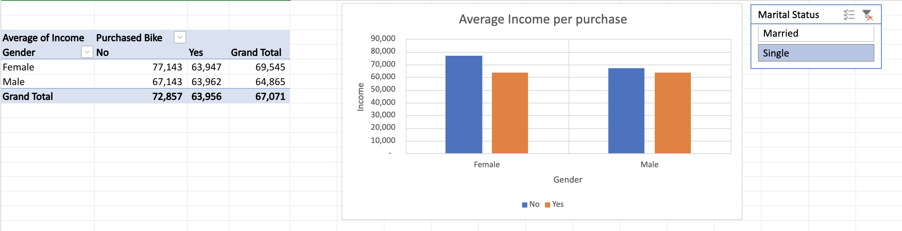
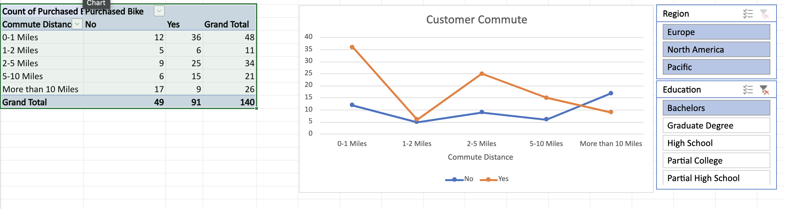
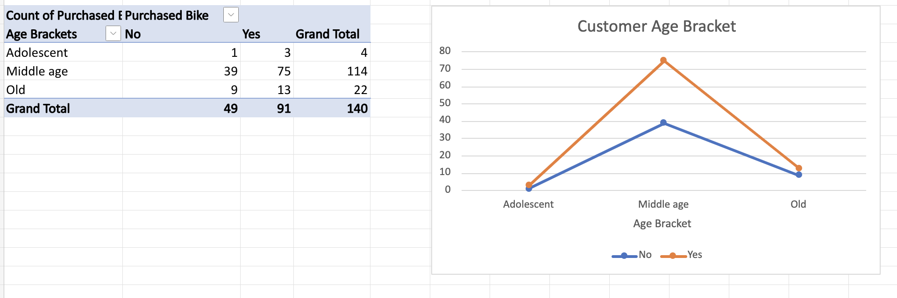
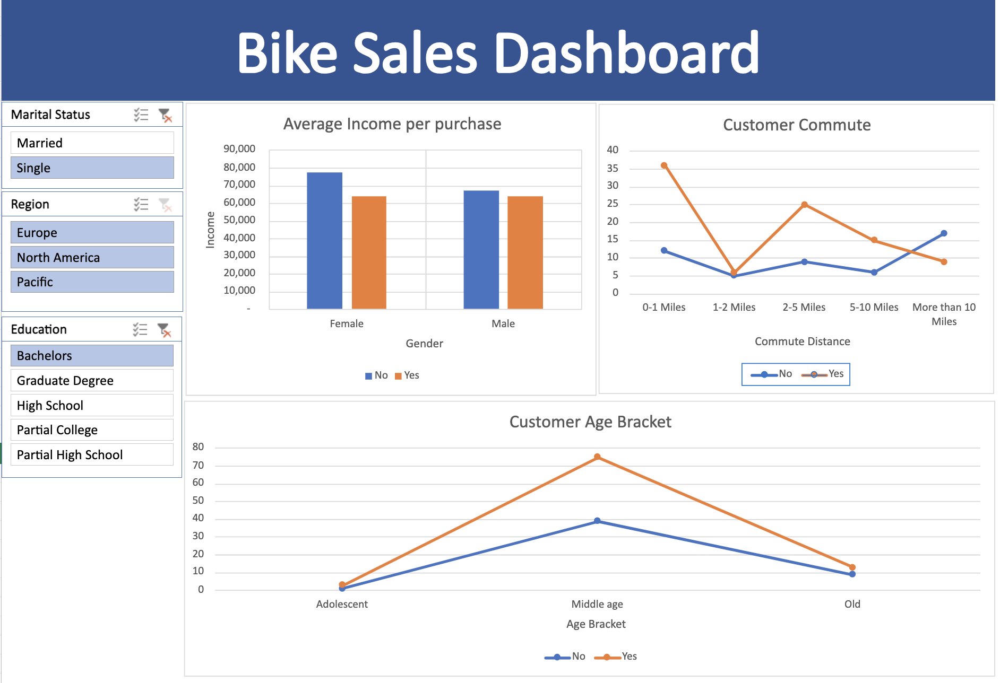

## Bike Sale Dashboard using Excel

I performed data cleaning in the working sheet using Excel and created a pivot table to calculate the average income per purchase, customer commute, and customer age brackets. Additionally, I designed charts and a dashboard with slicers for marital status, region, and education, allowing the charts to update in real-time based on these filters.

### Average Income Per Purchase

### Customer Commute

### Customer Age Bracket

### Dashboard

